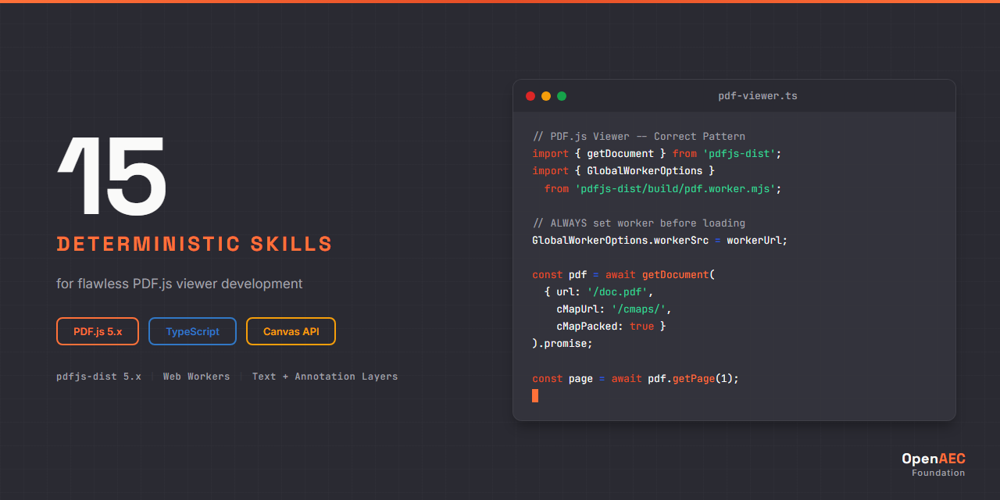

# PDF.js Claude Skill Package

<p align="center">
  
</p>


**15 deterministic Claude AI skills for PDF.js (Mozilla) PDF rendering and viewer development — TypeScript/JavaScript coverage.**

Built on the [Agent Skills](https://agentskills.org) open standard.

---

## Why This Exists

Without skills, Claude generates incorrect PDF.js code:

```javascript
// Wrong — missing worker setup, no DPI handling, deprecated API
const pdf = await pdfjsLib.getDocument('document.pdf');
const page = await pdf.getPage(1);
const canvas = document.getElementById('canvas');
const ctx = canvas.getContext('2d');
page.render({ canvasContext: ctx, viewport: page.getViewport(1.0) });
```

With this skill package, Claude produces correct PDF.js code:

```typescript
// Correct — worker configured, proper viewport, DPI-aware rendering
import * as pdfjsLib from 'pdfjs-dist';

pdfjsLib.GlobalWorkerOptions.workerSrc = `//unpkg.com/pdfjs-dist@${pdfjsLib.version}/build/pdf.worker.min.mjs`;

const loadingTask = pdfjsLib.getDocument('document.pdf');
const pdf = await loadingTask.promise;
const page = await pdf.getPage(1);
const scale = 1.5;
const viewport = page.getViewport({ scale });
const canvas = document.getElementById('canvas') as HTMLCanvasElement;
const ctx = canvas.getContext('2d')!;
const dpr = window.devicePixelRatio || 1;
canvas.width = Math.floor(viewport.width * dpr);
canvas.height = Math.floor(viewport.height * dpr);
canvas.style.width = `${Math.floor(viewport.width)}px`;
canvas.style.height = `${Math.floor(viewport.height)}px`;
ctx.scale(dpr, dpr);
await page.render({ canvasContext: ctx, viewport }).promise;
```

---

## Skills (15)

See [INDEX.md](INDEX.md) for the complete catalog with links.

| Category | Skills | Description |
|----------|--------|-------------|
| **Core** | 2 | Architecture, layers, worker model, memory management |
| **Syntax** | 5 | Worker setup, document loading, page rendering, text layer, annotation layer |
| **Implementation** | 3 | Custom viewer, bundler integration, forms & save |
| **Error Handling** | 3 | Worker errors, rendering errors, document errors |
| **Agents** | 2 | Code review checklist, project scaffolder |

Each skill includes:
- `SKILL.md` — Main skill file (< 500 lines, deterministic ALWAYS/NEVER language)
- `references/methods.md` — Complete API signatures
- `references/examples.md` — Working, copy-paste-ready code
- `references/anti-patterns.md` — What NOT to do (with correct alternatives)

## Installation

### Claude Code

```bash
# Option 1: Clone the full package
git clone https://github.com/OpenAEC-Foundation/PDFjs-Claude-Skill-Package.git
cp -r PDFjs-Claude-Skill-Package/skills/source/ ~/.claude/skills/pdfjs/

# Option 2: Add as git submodule
git submodule add https://github.com/OpenAEC-Foundation/PDFjs-Claude-Skill-Package.git .claude/skills/pdfjs
```

### Claude.ai (Web)

Upload individual SKILL.md files as project knowledge.

## Version Compatibility

| Technology | Versions | Notes |
|------------|----------|-------|
| pdfjs-dist | **5.x** | Primary target (current: 5.5.207) |
| TypeScript | 4.x / 5.x | Type safety |
| Node.js | 18+ | Build tooling |
| Browsers | Modern (Chrome, Firefox, Safari, Edge) | Full support |

## Documentation

| Document | Purpose |
|----------|---------|
| [INDEX.md](INDEX.md) | Complete skill catalog with links |
| [ROADMAP.md](ROADMAP.md) | Project status (single source of truth) |
| [REQUIREMENTS.md](REQUIREMENTS.md) | Quality guarantees and per-area requirements |
| [DECISIONS.md](DECISIONS.md) | Architectural decisions with rationale |
| [SOURCES.md](SOURCES.md) | Official reference URLs and verification rules |
| [WAY_OF_WORK.md](WAY_OF_WORK.md) | 7-phase development methodology |
| [LESSONS.md](LESSONS.md) | Lessons learned during development |
| [CHANGELOG.md](CHANGELOG.md) | Version history |

## Related Projects

| Project | Description |
|---------|-------------|
| [ERPNext Skill Package](https://github.com/OpenAEC-Foundation/ERPNext_Anthropic_Claude_Development_Skill_Package) | 28 skills for ERPNext/Frappe development |
| [Tauri 2 Skill Package](https://github.com/OpenAEC-Foundation/Tauri-2-Claude-Skill-Package) | 27 skills for Tauri 2 desktop applications |
| [Blender-Bonsai Skill Package](https://github.com/OpenAEC-Foundation/Blender-Bonsai-ifcOpenshell-Sverchok-Claude-Skill-Package) | 73 skills for Blender, Bonsai, IfcOpenShell & Sverchok |
| [OpenAEC Foundation](https://github.com/OpenAEC-Foundation) | Parent organization |

## License

[MIT](LICENSE)

---

Part of the [OpenAEC Foundation](https://github.com/OpenAEC-Foundation) ecosystem.
